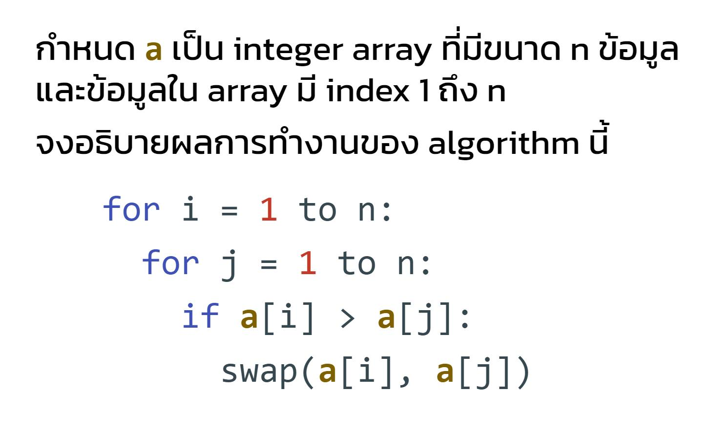

ไม่ใช่ทั้ง selection sort และ bubble sort นะครับ จริงๆแล้วโค้ดนี้ไม่ใช่ sorting algorithm ที่มีอยู่ในตำราเล่มใดในโลกนี้ เพราะไม่มี sorting algorithm ใดที่ loop ชั้นนอกและชั้นในจะวนตั้งแต่ข้อมูลแรกไปจนถึงข้อมูลตัวสุดท้ายของ array ทั้ง 2 ชั้น

แต่..โค้ดนี้เป็นการ sorting และสามารถ sort ได้จริงๆ

ผมว่ามันดูคล้าย selection sort ต่างกันตรงที่ selection sort นั้น loop ชั้นในจะวนตั้งแต่ i + 1 ไปจนถึง n (i คือค่าปัจจุบันของ loop ชั้นนอก) แต่โค้ดนี้ loop ชั้นในจะวนตั้งแต่ 1 ถึง n เสมอ โดยไม่สนใจค่า i

ถ้าหากเปลี่ยนเป็น selection sort คือเปลี่ยนการวน loop ชั้นในเป็น i + 1 ถึง n, โค้ดนี้จะเรียงข้อมูลใน array จากน้อยไปหามาก (ascending)

หลายคนที่เห็นโค้ดนี้จึงคิดว่าเป็นการเรียงจากน้อยไปมาก เพราะหน้าตามันใกล้เคียง selection sort อย่างที่บอก

แต่พอสังเกตดีๆว่า loop ชั้นในมันวน 1 ถึง n นี่นา ก็จะเริ่มเปลี่ยนความคิดว่า โค้ดนี้ไม่น่าจะ sort ได้ ใครเขียนแบบนี้ต้องผิดแน่ๆ ซึ่งผมคือหนึ่งในนั้นที่คิดแบบนี้ตอนเห็นครั้งแรก

แต่จริงๆแล้ว โค้ดนี้สามารถ sort ได้นะครับ และที่แปลกคือ ถึงแม้หน้าตามันจะคล้าย selection sort แต่ให้ผลตรงกันข้ามเลย คือโค้ดนี้จะเรียงข้อมูลจาก "มากไปหาน้อย" (descending)

ที่สำคัญ อย่าได้ไปถาม ChatGPT เชียวครับ เราจะได้คำตอบว่าโค้ดนี้คือ bubble sort และถ้าถามต่อว่า ascending or descending พี่เขาก็จะตอบมาให้เราเจ็บใจ (ในภายหลัง) ว่า ascending

ใครอยากทดสอบด้วยโค้ดจริง ผมเตรียมมาให้ 2 ภาษาคือ Python กับ JavaScript ที่ link นี้ครับ https://github.com/3bugs/surprise-sort

ข้อมูลเพิ่มเติม: https://browse.arxiv.org/pdf/2110.01111.pdf

### โค้ด Python

```python
def sort(a):
    n = len(a)
    for i in range(n):
        for j in range(n):
            if a[i] > a[j]:
                temp = a[i]
                a[i] = a[j]
                a[j] = temp

my_arr = [5, 3, 7, 4, 2, 0, 8, 6, 9, 1]
print(f"Before sorting: {my_arr}")
sort(my_arr)
print(f"After sorting: {my_arr}")
```

### โค้ด JavaScript

```javascript
function sort(a) {
  for (let i = 0; i < a.length; i++) {
    for (let j = 0; j < a.length; j++) {
      if (a[i] > a[j]) {
        const temp = a[i];
        a[i] = a[j];
        a[j] = temp;
      }
    }
  }
}

const myArr = [5, 3, 7, 4, 2, 0, 8, 6, 9, 1];
console.log(`Before soring: ${myArr}`);
sort(myArr);
console.log(`After soring: ${myArr}`);
```
